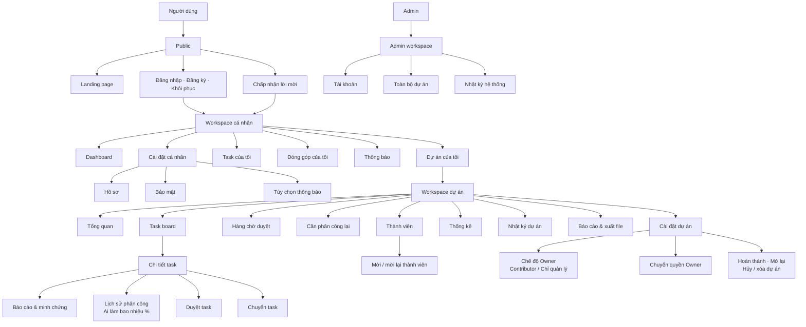
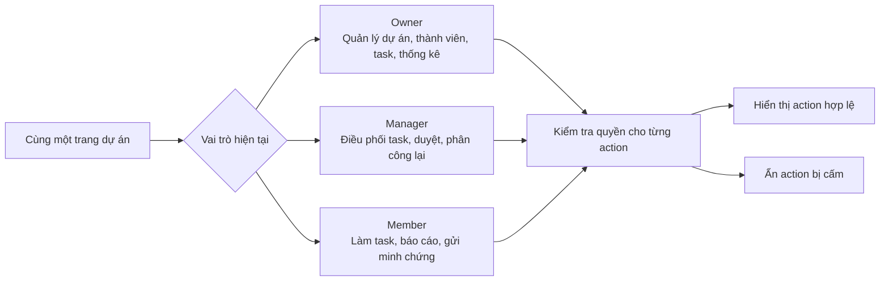
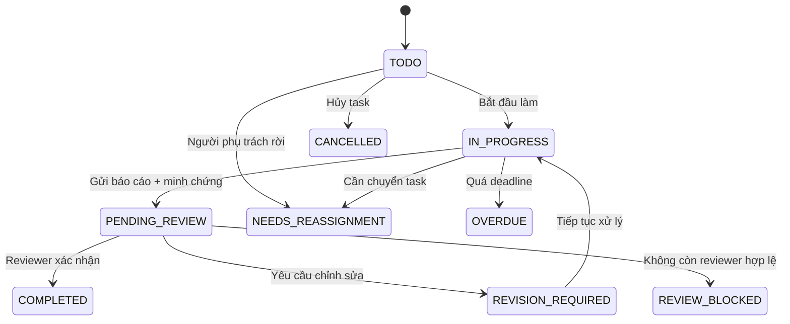
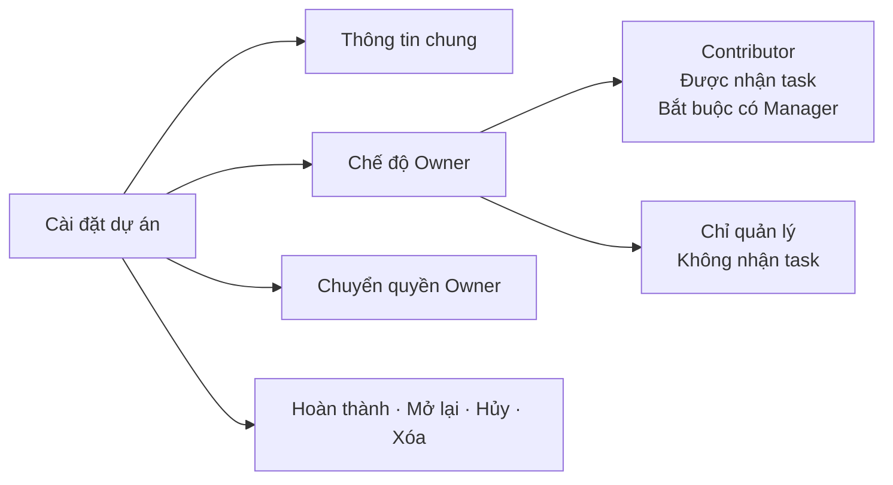

# FRONTEND OVERVIEW

> Bản đồ giao diện rút gọn dành cho toàn team. Chi tiết route, quyền và trạng thái xem tại [SITEMAP.md](./SITEMAP.md).

## 1. Toàn cảnh sản phẩm



## 2. Một giao diện, nội dung theo vai trò



| Vai trò | Nhìn thấy đầu tiên | Hành động quan trọng |
|---|---|---|
| Owner | Tiến độ dự án, task chờ duyệt, thành viên | Quản lý dự án, giao task, chuyển quyền |
| Manager | Task chờ duyệt, quá hạn, cần phân công lại | Tạo/giao task, review, chuyển task |
| Member | Task của tôi, deadline, phản hồi reviewer | Báo cáo tiến độ, gửi minh chứng, gửi duyệt |
| Admin | Tài khoản, dự án hệ thống, hoạt động gần đây | Quản lý tài khoản và giám sát hệ thống |

## 3. Khung màn hình chính

```text
┌──────────────────────────────────────────────────────────────────────┐
│ Logo  / Breadcrumb             Search     🔔 Thông báo     Avatar   │
├────────────────┬─────────────────────────────────────────────────────┤
│ Dashboard      │ Tiêu đề trang                           [CTA chính] │
│ Projects       ├─────────────────────────────────────────────────────┤
│ My Tasks       │                                                     │
│ Contributions  │                 NỘI DUNG TRANG                      │
│ Notifications  │                                                     │
│                │ Dashboard · Board · Table · Form · Timeline         │
│ Project menu   │                                                     │
│ ├─ Overview    │                                                     │
│ ├─ Tasks       │                                                     │
│ ├─ Reviews     │                                                     │
│ ├─ Reassign    │                                                     │
│ ├─ Members     │                                                     │
│ ├─ Statistics  │                                                     │
│ └─ Settings    │                                                     │
└────────────────┴─────────────────────────────────────────────────────┘
```

Trên mobile: sidebar thành menu drawer; điều hướng chính nằm ở thanh dưới; bảng task chuyển thành danh sách card.

## 4. Luồng task quan trọng nhất



```text
TASK DETAIL
┌────────────────────────────────────┬─────────────────────────────────┐
│ Mô tả & tiêu chí hoàn thành        │ Assignee · Reviewer · Deadline │
│ Tiến độ hiện tại                   │ Priority · Weight · Status      │
├────────────────────────────────────┼─────────────────────────────────┤
│ Reports · Evidence · Assignments   │ Cập nhật tiến độ                │
│ Báo cáo và phản hồi                │ Gửi duyệt / Review / Transfer   │
│ Ai làm: 0→40% · 40→75% · 75→100%   │ Đóng góp được công nhận         │
└────────────────────────────────────┴─────────────────────────────────┘
```

Lịch sử phân công là dữ liệu cốt lõi của task chuyển giao: mỗi giai đoạn phải lưu người thực hiện, khoảng tiến độ, thời gian, lý do chuyển và tỷ lệ đóng góp được công nhận.

## 5. Các màn hình cần thiết kế trước

| Thứ tự | Màn hình | Route | Kết quả cần nhìn thấy |
|---:|---|---|---|
| 1 | App shell | Toàn workspace | Header, sidebar, responsive navigation |
| 2 | Auth | `/auth/*` | Login, register, recovery, validation |
| 3 | Dashboard | `/dashboard` | Việc cần làm, dự án, deadline, review |
| 4 | Project overview | `/projects/:projectId` | Tiến độ, cảnh báo, thành viên |
| 5 | Task board | `.../tasks` | Trạng thái task và bộ lọc |
| 6 | Task detail | `.../tasks/:taskId` | Tiến độ, báo cáo, minh chứng, action |
| 7 | Assignment history | `.../assignments` | Các giai đoạn thực hiện và % đóng góp |
| 8 | Review queue | `.../reviews` | Tất cả task đang chờ người dùng duyệt |
| 9 | Review detail | `.../review` | Submission, feedback, quyết định |
| 10 | Reassignments | `.../reassignments` | Task cần giao lại hoặc bị chặn duyệt |
| 11 | Members | `.../members` | Role, status, contribution |
| 12 | Invite member | `.../members/invite` | Mời mới hoặc mời lại người đã rời |
| 13 | Statistics | `.../statistics` | Tiến độ trọng số và đóng góp |
| 14 | Project activity | `.../activity` | Dòng thời gian của riêng dự án |
| 15 | Project reports | `.../reports` | Báo cáo tổng hợp và xuất file |
| 16 | Project settings | `.../settings/*` | Chế độ Owner, ownership, vòng đời dự án |
| 17 | Personal settings | `/settings/*` | Hồ sơ, bảo mật, thông báo |
| 18 | Admin | `/admin/*` | Users, projects, system logs |

## 6. Các khu vực quản lý quan trọng

### Hàng chờ duyệt

Màn hình tổng hợp task `PENDING_REVIEW` mà Owner/Manager hiện tại được phép duyệt. Có bộ lọc theo dự án, assignee, deadline và thời gian chờ; không đưa task của chính reviewer vào danh sách.

### Cần phân công lại

Gồm task `NEEDS_REASSIGNMENT` và `REVIEW_BLOCKED`. Manager có thể chọn người nhận, reviewer mới, cách xử lý tiến độ cũ và tỷ lệ đóng góp được công nhận.

### Cài đặt dự án



### Thành viên và lời mời

Trang “Mời thành viên” phải xử lý cả người mới và người từng `LEFT`/`REMOVED`. Khi mời lại, hệ thống kích hoạt bản ghi cũ, giữ lịch sử đóng góp và không tự động trả lại task đã chuyển.

## 7. Quy tắc frontend không được bỏ qua

- Không ai được tự duyệt task của chính mình.
- Owner ở chế độ `MANAGEMENT_ONLY` không được nhận task.
- Dự án `COMPLETED` hoặc `CANCELLED` phải hiển thị ở chế độ chỉ đọc.
- Rời dự án, loại thành viên hoặc hủy task không được xóa lịch sử đóng góp.
- Mọi màn hình phải có trạng thái loading, empty, error và forbidden.
- Action bị cấm phải được ẩn; backend vẫn kiểm tra quyền lại.

