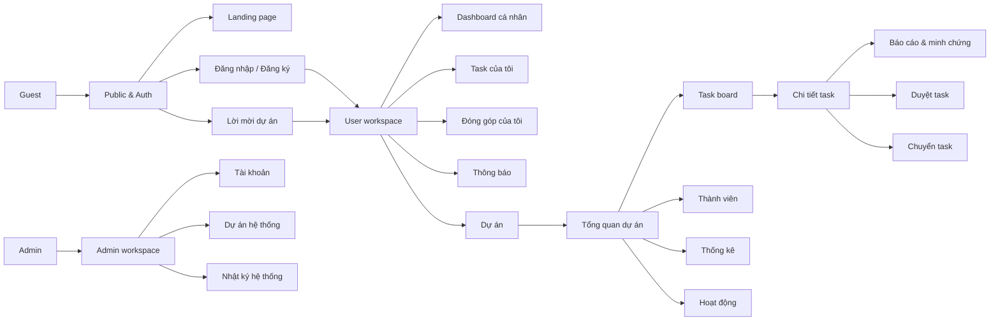
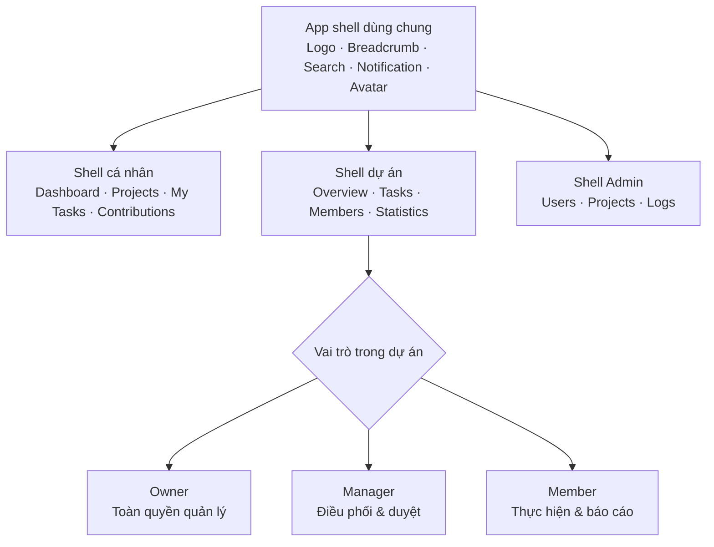
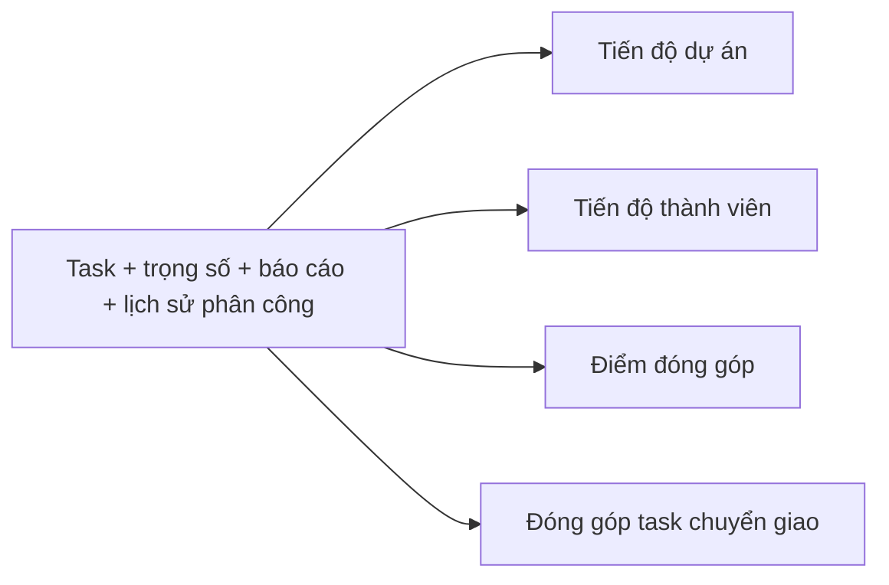

# SITEMAP — PROJECT CONTRIBUTION TRACKING SYSTEM
**Hệ thống ghi nhận và theo dõi đóng góp trong dự án nhóm**

| Thuộc tính | Nội dung |
|---|---|
| Tài liệu | Sitemap & Route Specification |
| Phiên bản | 1.1 — kết hợp sitemap nhóm và đặc tả frontend |
| Nguồn tham chiếu | System Design Document v1.0 |
| Phạm vi | MVP |

> Mục tiêu của tài liệu: giúp Product, UI/UX, Frontend, Backend và QA cùng nhìn thấy một bản đồ thống nhất về trang, quyền truy cập, luồng thao tác và trạng thái giao diện.

---

## 1. Quy ước

### 1.1. Ký hiệu quyền truy cập

| Ký hiệu | Ý nghĩa |
|---|---|
| `PUBLIC` | Không cần đăng nhập |
| `AUTH` | Cần đăng nhập (mọi User) |
| `OWNER` | Owner của dự án |
| `MANAGER` | Manager của dự án |
| `MEMBER` | Member của dự án |
| `ADMIN` | Quyền cấp hệ thống |
| `OWNER_CONTRIB` | Chỉ khi Owner ở chế độ CONTRIBUTOR |

### 1.2. Quy ước tham số route

- `:projectId` — mã dự án
- `:taskId` — mã task
- `:memberId` — mã thành viên trong dự án (project_member)
- `:userId` — mã tài khoản hệ thống
- `:reportId` — mã báo cáo tiến độ
- `:token` — token của lời mời / đặt lại mật khẩu

### 1.3. Nguyên tắc thiết kế điều hướng

1. **Một shell, ba ngữ cảnh**: Ngữ cảnh cá nhân (`/dashboard`, `/my-tasks`), ngữ cảnh dự án (`/projects/:projectId/*`), ngữ cảnh hệ thống (`/admin/*`).
2. **UI theo vai trò, không theo trang riêng**: Cùng một route `/projects/:projectId`, nội dung hiển thị khác nhau theo Owner / Manager / Member thay vì tạo 3 URL khác nhau.
3. **Không có trang nào cho phép tự duyệt task của chính mình** — nút "Duyệt" bị ẩn hoàn toàn khi reviewer trùng người thực hiện.
4. **Không có trang xóa dữ liệu đóng góp** — mọi hành động rời/loại/hủy chỉ đổi trạng thái.

---

## 2. Sơ đồ cây sitemap

```
/
├── (PUBLIC)
│   ├── /                                   Landing page
│   ├── /auth/login                         Đăng nhập
│   ├── /auth/register                      Đăng ký
│   ├── /auth/forgot-password               Quên mật khẩu
│   ├── /auth/reset-password                Đặt lại mật khẩu (?token)
│   ├── /auth/verify-email                  Xác thực email (?token)
│   └── /invitations/:token                 Chấp nhận lời mời vào dự án
│
├── (AUTH — Ngữ cảnh cá nhân)
│   ├── /dashboard                          Dashboard cá nhân đa dự án
│   ├── /my-tasks                           Task của tôi (mọi dự án)
│   ├── /my-contributions                   Đóng góp cá nhân tổng hợp
│   ├── /notifications                      Trung tâm thông báo
│   └── /settings
│       ├── /settings/profile               Hồ sơ cá nhân
│       ├── /settings/account               Bảo mật & mật khẩu
│       └── /settings/notifications         Tùy chọn thông báo
│
├── (AUTH — Ngữ cảnh dự án)
│   ├── /projects                           Danh sách dự án của tôi
│   ├── /projects/new                       Wizard tạo dự án
│   └── /projects/:projectId
│       ├── /                               Tổng quan dự án (Dashboard theo vai trò)
│       ├── /tasks                          Danh sách / Board task
│       │   ├── /new                        Tạo task
│       │   └── /:taskId                    Chi tiết task
│       │       ├── /reports                Lịch sử báo cáo tiến độ
│       │       ├── /assignments            Lịch sử phân công & đóng góp
│       │       ├── /review                 Màn hình kiểm tra & xác nhận
│       │       └── /transfer               Chuyển task
│       ├── /reviews                        Hàng chờ duyệt
│       ├── /reassignments                  Task cần phân công lại
│       ├── /members                        Quản lý thành viên
│       │   ├── /invite                     Mời thành viên
│       │   └── /:memberId                  Hồ sơ đóng góp thành viên
│       ├── /statistics                     Thống kê tiến độ & đóng góp
│       ├── /activity                       Nhật ký hoạt động dự án
│       ├── /reports                        Báo cáo tổng hợp & xuất file
│       └── /settings                       Cài đặt dự án
│           ├── /general                    Thông tin & thời gian dự án
│           ├── /participation              Chế độ tham gia của Owner
│           ├── /ownership                  Chuyển quyền Owner
│           └── /danger-zone                Hoàn thành / Hủy / Xóa dự án
│
├── (ADMIN — Ngữ cảnh hệ thống)
│   ├── /admin                              Dashboard Admin
│   ├── /admin/users                        Danh sách tài khoản
│   │   ├── /new                            Tạo tài khoản
│   │   └── /:userId                        Chi tiết & xử lý tài khoản
│   ├── /admin/projects                     Danh sách toàn bộ dự án
│   │   └── /:projectId                     Chi tiết dự án (chỉ đọc)
│   └── /admin/logs                         Nhật ký hoạt động hệ thống
│
└── (SYSTEM)
    ├── /403                                Không đủ quyền
    ├── /404                                Không tìm thấy
    └── /500                                Lỗi hệ thống
```

### 2.1. Bản đồ trực quan toàn hệ thống



### 2.2. Ba shell giao diện



**Quyết định thống nhất:** giữ một route cho cùng một tài nguyên; giao diện, nút hành động và dữ liệu sẽ thay đổi theo quyền. Không tạo ba phiên bản trang riêng cho Owner, Manager và Member.

---

## 3. Chi tiết nhóm trang PUBLIC

### 3.1. `/` — Landing page
| Mục | Nội dung |
|---|---|
| Quyền | `PUBLIC` |
| Mục đích | Giới thiệu hệ thống, dẫn người dùng đăng ký/đăng nhập |
| Thành phần | Hero + giá trị cốt lõi (minh bạch đóng góp), so sánh với công cụ quản lý task thông thường, mô tả 3 vai trò, CTA đăng ký |
| Điều hướng ra | `/auth/register`, `/auth/login` |
| Ghi chú | Nếu đã đăng nhập → tự động chuyển tới `/dashboard` |

### 3.2. `/auth/login` — Đăng nhập
| Mục | Nội dung |
|---|---|
| Quyền | `PUBLIC` |
| Thành phần | Form email + mật khẩu, ghi nhớ đăng nhập, link quên mật khẩu / đăng ký |
| Trạng thái đặc biệt | Tài khoản bị Admin khóa → thông báo rõ lý do, không cho vào hệ thống |
| Điều hướng ra | `/dashboard`, hoặc redirect về URL người dùng định truy cập trước đó |

### 3.3. `/auth/register` — Đăng ký
| Mục | Nội dung |
|---|---|
| Quyền | `PUBLIC` |
| Thành phần | Họ tên, email, mật khẩu, xác nhận mật khẩu, đồng ý điều khoản |
| Ghi chú | Mọi tài khoản đăng ký đều là **User** (không có tùy chọn chọn vai trò hệ thống) |

### 3.4. `/auth/forgot-password` & `/auth/reset-password`
| Mục | Nội dung |
|---|---|
| Quyền | `PUBLIC` |
| Thành phần | Nhập email → gửi link; trang đặt lại mật khẩu nhận `?token` |
| Trạng thái lỗi | Token hết hạn / không hợp lệ → màn hình yêu cầu gửi lại |

### 3.5. `/invitations/:token` — Chấp nhận lời mời
| Mục | Nội dung |
|---|---|
| Quyền | `PUBLIC` → yêu cầu đăng nhập trước khi xác nhận |
| Mục đích | Chuyển trạng thái thành viên từ `PENDING` → `ACTIVE` |
| Thành phần | Tên dự án, Owner, vai trò được mời, mô tả ngắn, nút Chấp nhận / Từ chối |
| Trường hợp đặc biệt | Nếu người này **đã từng tham gia** dự án → hiển thị "Tham gia lại", nêu rõ lịch sử đóng góp cũ sẽ được giữ nguyên và các task đã chuyển đi **không** tự động trả lại |

---

## 4. Chi tiết nhóm trang CÁ NHÂN

### 4.1. `/dashboard` — Dashboard cá nhân
| Mục | Nội dung |
|---|---|
| Quyền | `AUTH` |
| Mục đích | Tổng hợp mọi dự án người dùng đang tham gia (Dashboard Member ở mục 15.2 của SDD, mở rộng đa dự án) |
| Khối hiển thị | Dự án đang tham gia (kèm vai trò) · Task được giao · Task sắp đến hạn · Task quá hạn · Task cần chỉnh sửa (`REVISION_REQUIRED`) · Task đang chờ duyệt · Tiến độ cá nhân · Báo cáo gần nhất · Phản hồi mới từ reviewer |
| Khối bổ sung theo vai trò | Nếu là Owner/Manager ở ít nhất 1 dự án → thêm khối "Chờ tôi duyệt" và "Task cần phân công lại" |
| Trạng thái rỗng | Chưa có dự án nào → CTA "Tạo dự án" |

### 4.2. `/my-tasks` — Task của tôi
| Mục | Nội dung |
|---|---|
| Quyền | `AUTH` |
| Thành phần | Bảng task xuyên suốt mọi dự án |
| Bộ lọc | Dự án · Trạng thái · Mức ưu tiên · Deadline · Chỉ task quá hạn |
| Nhóm hiển thị | Cần xử lý gấp (`OVERDUE`, `REVISION_REQUIRED`) → Đang làm → Chờ duyệt → Đã hoàn thành |
| Hành động nhanh | Cập nhật %, gửi báo cáo, gửi duyệt, xin chuyển task |

### 4.3. `/my-contributions` — Đóng góp cá nhân tổng hợp
| Mục | Nội dung |
|---|---|
| Quyền | `AUTH` |
| Chỉ số | Tổng task từng được giao · Task đang phụ trách · Task đã hoàn thành · Task quá hạn · Task đã chuyển cho người khác · Tổng trọng số hoàn thành · Số lần báo cáo tiến độ · Lần hoạt động gần nhất |
| Trực quan | Biểu đồ đóng góp theo dự án, dòng thời gian hoạt động |
| Ghi chú | Bao gồm cả các dự án đã `LEFT`/`REMOVED` — dữ liệu đóng góp cũ không bị mất |

### 4.4. `/notifications` — Trung tâm thông báo
| Mục | Nội dung |
|---|---|
| Quyền | `AUTH` |
| Loại thông báo | Được mời vào dự án · Được giao task · Task được duyệt · Task bị yêu cầu chỉnh sửa · Task sắp/đã quá hạn · Task cần phân công lại · Yêu cầu chuyển task · Task bị chặn duyệt (`REVIEW_BLOCKED`) · Thay đổi quyền · Thay đổi trạng thái dự án |
| Tính năng | Lọc theo loại/dự án, đánh dấu đã đọc, đánh dấu tất cả |

### 4.5. `/settings/*` — Cài đặt cá nhân
| Route | Nội dung |
|---|---|
| `/settings/profile` | Ảnh đại diện, họ tên, thông tin liên hệ |
| `/settings/account` | Đổi mật khẩu, phiên đăng nhập |
| `/settings/notifications` | Bật/tắt từng loại thông báo trong hệ thống |

---

## 5. Chi tiết nhóm trang DỰ ÁN

### 5.1. `/projects` — Danh sách dự án
| Mục | Nội dung |
|---|---|
| Quyền | `AUTH` |
| Thành phần | Card/bảng dự án: tên, trạng thái (`DRAFT`/`ACTIVE`/`COMPLETED`/`CANCELLED`), vai trò của tôi, tiến độ %, số task của tôi, deadline gần nhất |
| Bộ lọc | Trạng thái dự án · Vai trò của tôi · Đang tham gia / Đã rời |
| Hành động | Tạo dự án mới, xem lời mời đang chờ (`PENDING`) |

### 5.2. `/projects/new` — Wizard tạo dự án
| Mục | Nội dung |
|---|---|
| Quyền | `AUTH` |
| Bước 1 | Thông tin dự án: tên, mô tả, ngày bắt đầu, ngày kết thúc |
| Bước 2 | **Chế độ tham gia của Owner** — lựa chọn bắt buộc: `CONTRIBUTOR` (vừa quản lý vừa nhận task) hoặc `MANAGEMENT_ONLY` (chỉ quản lý) |
| Bước 3 | Mời thành viên & phân quyền Manager/Member |
| Bước 4 | Xác nhận & tạo |
| Cảnh báo trong luồng | Nếu chọn `CONTRIBUTOR` mà chưa có Manager nào → dự án được tạo ở trạng thái `DRAFT`, hiển thị rõ điều kiện để chuyển sang `ACTIVE` |
| Kết quả | Chuyển tới `/projects/:projectId` |

### 5.3. `/projects/:projectId` — Tổng quan dự án
| Mục | Nội dung |
|---|---|
| Quyền | `OWNER` `MANAGER` `MEMBER` |
| **Hiển thị cho Owner / Manager** | Tổng số task · Task hoàn thành · Task đang thực hiện · Task quá hạn · Task chờ duyệt · Task cần phân công lại · Tiến độ toàn dự án · Tiến độ từng thành viên · Thành viên đã rời · Task sắp đến hạn · Task bị chặn duyệt · Hoạt động gần đây |
| **Hiển thị cho Member** | Task được giao · Task sắp đến hạn · Task quá hạn · Task cần chỉnh sửa · Task đang chờ duyệt · Tiến độ cá nhân · Báo cáo gần nhất · Phản hồi từ reviewer |
| Banner trạng thái | `DRAFT` → liệt kê checklist điều kiện còn thiếu · `REVIEW_BLOCKED` tồn tại → cảnh báo cần thêm Manager · `COMPLETED`/`CANCELLED` → chế độ chỉ đọc |

### 5.4. `/projects/:projectId/tasks` — Danh sách task
| Mục | Nội dung |
|---|---|
| Quyền | `OWNER` `MANAGER` `MEMBER` (Member mặc định lọc theo task của mình, có thể xem toàn bộ ở chế độ chỉ đọc) |
| Chế độ xem | Board theo trạng thái · List/bảng · Timeline theo deadline |
| Cột board | `TODO` → `IN_PROGRESS` → `PENDING_REVIEW` → `REVISION_REQUIRED` → `COMPLETED`; nhóm riêng: `OVERDUE`, `NEEDS_REASSIGNMENT`, `REVIEW_BLOCKED`, `CANCELLED` |
| Bộ lọc | Người phụ trách · Reviewer · Trạng thái · Ưu tiên · Trọng số · Deadline |
| Hành động | Tạo task (`OWNER`/`MANAGER`), giao task, chuyển task, mở chi tiết |

### 5.5. `/projects/:projectId/tasks/new` — Tạo task
| Mục | Nội dung |
|---|---|
| Quyền | `OWNER` `MANAGER` |
| Trường nhập | Tên task · Mô tả · Người phụ trách · Người kiểm tra · Ngày bắt đầu · Deadline · Mức độ ưu tiên · Trọng số · Tiêu chí hoàn thành · File đính kèm |
| Ràng buộc UI | Dropdown "Người phụ trách" chỉ liệt kê thành viên `ACTIVE`; loại trừ Owner nếu Owner ở chế độ `MANAGEMENT_ONLY`; loại trừ thành viên `PENDING`/`LEFT`/`REMOVED` |
| Ràng buộc reviewer | Dropdown "Người kiểm tra" loại trừ chính người phụ trách; theo ma trận: Owner→Manager, Manager→Owner hoặc Manager khác, Member→Owner hoặc Manager |
| Cảnh báo | Nếu không còn reviewer hợp lệ → cảnh báo task sẽ rơi vào `REVIEW_BLOCKED` |

### 5.6. `/projects/:projectId/tasks/:taskId` — Chi tiết task
| Mục | Nội dung |
|---|---|
| Quyền | `OWNER` `MANAGER` `MEMBER` (Member chỉ chỉnh sửa được task mình phụ trách) |
| Khối thông tin | Toàn bộ trường của task + người tạo + ngày tạo/cập nhật + trạng thái hiện tại |
| Khối tiến độ | Thanh % hoàn thành, tiêu chí hoàn thành dạng checklist |
| Tab con | **Báo cáo** (`/reports`) · **Lịch sử phân công** (`/assignments`) · **Minh chứng** · **Bình luận / phản hồi reviewer** |
| Hành động của Member phụ trách | Cập nhật trạng thái · Cập nhật % · Gửi báo cáo tiến độ · Đính kèm minh chứng · Gửi duyệt · Gửi yêu cầu chuyển task |
| Hành động của Owner/Manager | Chỉnh sửa task · Giao lại · Chuyển task · Mở màn duyệt · Hủy task |
| Quy tắc ẩn nút | Nếu người đang xem là người phụ trách → **ẩn hoàn toàn** nút Duyệt/Yêu cầu chỉnh sửa |

### 5.7. `/projects/:projectId/tasks/:taskId/reports` — Lịch sử báo cáo tiến độ
| Mục | Nội dung |
|---|---|
| Quyền | `OWNER` `MANAGER` `MEMBER` |
| Hiển thị | Dòng thời gian các báo cáo, **không ghi đè, không cho xóa** |
| Mỗi báo cáo gồm | Người báo cáo · % hoàn thành tại thời điểm đó · Nội dung đã thực hiện · Khó khăn đang gặp · Công việc tiếp theo · File/đường dẫn minh chứng · Thời gian báo cáo |
| Form gửi báo cáo | Modal hoặc panel bên phải, chỉ mở cho người phụ trách hiện tại |

### 5.8. `/projects/:projectId/tasks/:taskId/assignments` — Lịch sử phân công & đóng góp
| Mục | Nội dung |
|---|---|
| Quyền | `OWNER` `MANAGER` `MEMBER` |
| Bảng giai đoạn | Người thực hiện · Bắt đầu (%) · Kết thúc (%) · Tiến độ đóng góp · Lý do chuyển · Người thực hiện việc chuyển · Thời gian |
| Khối tỷ lệ đóng góp | Biểu đồ chia tỷ lệ đóng góp giữa nhiều người trên cùng một task, kèm điểm quy đổi theo trọng số |
| Ràng buộc hiển thị | Tổng tỷ lệ đóng góp trong một task **không vượt quá 100%**; người hoàn thành cuối cùng **không** mặc định nhận toàn bộ đóng góp |

### 5.9. `/projects/:projectId/tasks/:taskId/review` — Kiểm tra & xác nhận
| Mục | Nội dung |
|---|---|
| Quyền | `OWNER` `MANAGER` — và **chỉ khi không phải người phụ trách** |
| Khối trái | Tiêu chí hoàn thành, báo cáo mới nhất, danh sách minh chứng (xem trước file/link) |
| Khối phải | Hành động của reviewer: Xác nhận hoàn thành · Yêu cầu chỉnh sửa · Viết phản hồi · Điều chỉnh mức độ hoàn thành được công nhận · Từ chối minh chứng không hợp lệ |
| Sau khi xác nhận | Task → `COMPLETED`, ghi nhận đóng góp theo trọng số, gửi thông báo cho người thực hiện |
| Chặn truy cập | Nếu người đang xem là người phụ trách → chuyển tới `/403` kèm giải thích quy tắc không tự duyệt |

### 5.10. `/projects/:projectId/tasks/:taskId/transfer` — Chuyển task
| Mục | Nội dung |
|---|---|
| Quyền | `OWNER` `MANAGER` (Member chỉ **gửi yêu cầu** chuyển từ trang chi tiết task) |
…3591 tokens truncated…rm |
| 3 | `/auth/register` | PUBLIC | Form |
| 4 | `/auth/forgot-password` | PUBLIC | Form |
| 5 | `/auth/reset-password` | PUBLIC | Form |
| 6 | `/auth/verify-email` | PUBLIC | Trạng thái |
| 7 | `/invitations/:token` | PUBLIC/AUTH | Xác nhận |
| 8 | `/dashboard` | AUTH | Dashboard |
| 9 | `/my-tasks` | AUTH | Danh sách |
| 10 | `/my-contributions` | AUTH | Thống kê |
| 11 | `/notifications` | AUTH | Danh sách |
| 12 | `/settings/profile` | AUTH | Form |
| 13 | `/settings/account` | AUTH | Form |
| 14 | `/settings/notifications` | AUTH | Form |
| 15 | `/projects` | AUTH | Danh sách |
| 16 | `/projects/new` | AUTH | Wizard |
| 17 | `/projects/:id` | Thành viên dự án | Dashboard |
| 18 | `/projects/:id/tasks` | Thành viên dự án | Board/List |
| 19 | `/projects/:id/tasks/new` | Owner/Manager | Form |
| 20 | `/projects/:id/tasks/:tid` | Thành viên dự án | Chi tiết |
| 21 | `/projects/:id/tasks/:tid/reports` | Thành viên dự án | Timeline |
| 22 | `/projects/:id/tasks/:tid/assignments` | Thành viên dự án | Timeline |
| 23 | `/projects/:id/tasks/:tid/review` | Reviewer hợp lệ | Form |
| 24 | `/projects/:id/tasks/:tid/transfer` | Owner/Manager | Form |
| 25 | `/projects/:id/reviews` | Owner/Manager | Danh sách |
| 26 | `/projects/:id/reassignments` | Owner/Manager | Danh sách |
| 27 | `/projects/:id/members` | Thành viên dự án | Bảng |
| 28 | `/projects/:id/members/invite` | Owner/Manager | Form |
| 29 | `/projects/:id/members/:mid` | Owner/Manager | Chi tiết |
| 30 | `/projects/:id/statistics` | Thành viên dự án | Thống kê |
| 31 | `/projects/:id/activity` | Owner/Manager | Timeline |
| 32 | `/projects/:id/reports` | Owner/Manager | Báo cáo |
| 33 | `/projects/:id/settings/general` | Owner | Form |
| 34 | `/projects/:id/settings/participation` | Owner | Form |
| 35 | `/projects/:id/settings/ownership` | Owner | Form |
| 36 | `/projects/:id/settings/danger-zone` | Owner | Hành động |
| 37 | `/admin` | Admin | Dashboard |
| 38 | `/admin/users` | Admin | Bảng |
| 39 | `/admin/users/new` | Admin | Form |
| 40 | `/admin/users/:uid` | Admin | Chi tiết |
| 41 | `/admin/projects` | Admin | Bảng |
| 42 | `/admin/projects/:id` | Admin | Chi tiết |
| 43 | `/admin/logs` | Admin | Danh sách |
| 44 | `/403` | Mọi | Lỗi |
| 45 | `/404` | Mọi | Lỗi |
| 46 | `/500` | Mọi | Lỗi |

**Tổng: 46 route** (trong đó 3 trang lỗi hệ thống).

---

## 12. Ghi chú triển khai

1. **Middleware phân quyền 2 lớp**: lớp 1 kiểm tra đăng nhập và vai trò hệ thống; lớp 2 kiểm tra vai trò trong `:projectId` — mọi route dưới `/projects/:projectId/` đều phải qua lớp 2.
2. **Guard "không tự duyệt"** nên đặt ở cả 3 tầng: ẩn nút ở UI, chặn route `/review`, và kiểm tra lại ở API.
3. **Trạng thái chỉ đọc** khi dự án `COMPLETED`/`CANCELLED` nên xử lý ở tầng layout của `/projects/:projectId`, không rải rác từng trang.
4. **Các trang cần phân trang từ đầu**: `/notifications`, `/projects/:id/activity`, `/admin/logs`, `/projects/:id/tasks`.
5. **Ưu tiên xây theo thứ tự**: Auth → Dự án + Thành viên → Task + Báo cáo → Duyệt → Chuyển task → Thống kê → Admin.

---

## 13. Blueprint frontend trực quan

### 13.1. Desktop app shell

```text
┌──────────────────────────────────────────────────────────────────────────────┐
│ Logo  / Breadcrumb                 Search     Notifications     Avatar ▾     │
├──────────────────┬───────────────────────────────────────────────────────────┤
│ Dashboard        │ Page title                                      Actions  │
│ Projects         │ Subtitle / role / project status                          │
│ My tasks         ├───────────────────────────────────────────────────────────┤
│ Contributions    │                                                           │
│ Notifications    │                    PAGE CONTENT                           │
│                  │                                                           │
│ Project context  │ Dashboard / Board / Table / Form / Timeline              │
│ ├─ Overview      │                                                           │
│ ├─ Tasks         │                                                           │
│ ├─ Members       │                                                           │
│ └─ Statistics    │                                                           │
├──────────────────┴───────────────────────────────────────────────────────────┤
│ System feedback: toast · modal · confirmation · loading · empty · error      │
└──────────────────────────────────────────────────────────────────────────────┘
```

### 13.2. Mobile app shell

```text
┌──────────────────────────────┐
│ ☰  Page title        🔔  ●   │
├──────────────────────────────┤
│ Project/status context       │
├──────────────────────────────┤
│                              │
│        PAGE CONTENT          │
│                              │
├──────────────────────────────┤
│ Home  Projects  Tasks  More  │
└──────────────────────────────┘
```

- Sidebar desktop chuyển thành drawer trên mobile.
- Bảng nhiều cột chuyển thành card/list; không ép người dùng cuộn ngang cho thao tác chính.
- CTA chính giữ ở đầu trang hoặc thanh hành động cuối màn hình.

### 13.3. Dashboard cá nhân — `/dashboard`

```text
┌──────────────────────────────────────────────────────────────────────────────┐
│ Xin chào, [Tên]                                      [+ Tạo dự án]          │
├──────────────┬──────────────┬──────────────┬──────────────┐                  │
│ Dự án active │ Task của tôi │ Sắp đến hạn  │ Chờ tôi duyệt│                  │
├────────────────────────────────────────────┬─────────────────────────────────┤
│ Task cần xử lý                             │ Dự án đang tham gia             │
│ • Overdue / Revision / Due soon            │ [Project card + role + progress]│
├────────────────────────────────────────────┼─────────────────────────────────┤
│ Hoạt động & phản hồi gần đây               │ Đóng góp cá nhân                │
│ Timeline                                   │ Progress / weighted contribution │
└────────────────────────────────────────────┴─────────────────────────────────┘
```

**Ưu tiên thông tin:** việc cần làm ngay → dự án đang tham gia → đóng góp → hoạt động gần đây. Khối “Chờ tôi duyệt” chỉ xuất hiện khi người dùng là reviewer hợp lệ.

### 13.4. Tổng quan dự án — `/projects/:projectId`

```text
┌──────────────────────────────────────────────────────────────────────────────┐
│ Project name  [ACTIVE]  My role: Manager                 [Project actions ▾]│
│ Progress 68%  ·  24 tasks  ·  3 overdue  ·  4 pending review               │
├────────────────────────────────────────────┬─────────────────────────────────┤
│ Tiến độ theo trọng số                      │ Cần chú ý                       │
│ [Progress chart]                           │ • Overdue                       │
│                                            │ • Review blocked                │
│                                            │ • Needs reassignment            │
├────────────────────────────────────────────┼─────────────────────────────────┤
│ Tiến độ thành viên                         │ Task sắp đến hạn                │
│ [Member + role + progress + contribution]  │ [Task compact list]             │
├────────────────────────────────────────────┴─────────────────────────────────┤
│ Hoạt động gần đây                                                            │
└──────────────────────────────────────────────────────────────────────────────┘
```

Banner trạng thái đặt trên cùng:

- `DRAFT`: checklist điều kiện để dự án chuyển sang `ACTIVE`.
- `COMPLETED` hoặc `CANCELLED`: toàn bộ nội dung ở chế độ chỉ đọc.
- Có `REVIEW_BLOCKED`: cảnh báo rõ nguyên nhân và CTA mời Manager hợp lệ.

### 13.5. Task board — `/projects/:projectId/tasks`

```text
┌──────────────────────────────────────────────────────────────────────────────┐
│ Tasks       [Search] [Assignee] [Status] [Priority] [Board | List] [+ Task] │
├──────────────┬──────────────┬──────────────┬──────────────┬──────────────────┤
│ TODO         │ IN PROGRESS  │ REVIEW       │ REVISION     │ COMPLETED        │
│ [Task card]  │ [Task card]  │ [Task card]  │ [Task card]  │ [Task card]      │
│ [Task card]  │ [Task card]  │              │              │                  │
├──────────────┴──────────────┴──────────────┴──────────────┴──────────────────┤
│ Exception lane: OVERDUE · NEEDS_REASSIGNMENT · REVIEW_BLOCKED · CANCELLED   │
└──────────────────────────────────────────────────────────────────────────────┘
```

Mỗi task card tối thiểu có: tên task, người phụ trách, deadline, priority, trọng số, phần trăm hoàn thành và trạng thái. Không dùng kéo-thả nếu thao tác đó có thể bỏ qua quy tắc reviewer hoặc phân quyền; thay đổi trạng thái quan trọng phải qua action có kiểm tra.

### 13.6. Chi tiết task — `/projects/:projectId/tasks/:taskId`

```text
┌──────────────────────────────────────────────────────────────────────────────┐
│ Breadcrumb / Task title                         [Status] [Primary action]    │
├────────────────────────────────────────────┬─────────────────────────────────┤
│ Mô tả & tiêu chí hoàn thành                │ Thông tin                       │
│                                            │ Assignee · Reviewer · Deadline  │
│ Tiến độ hiện tại [====== 60% ======]        │ Priority · Weight               │
│                                            │ Created by · Updated at         │
├────────────────────────────────────────────┼─────────────────────────────────┤
│ Tabs: Reports · Evidence · Assignments     │ Quick actions                   │
│ [Timeline báo cáo và phản hồi]             │ Update progress                 │
│                                            │ Submit for review               │
│                                            │ Request transfer                │
└────────────────────────────────────────────┴─────────────────────────────────┘
```

Action theo vai trò và trạng thái:

| Người xem | Action chính |
|---|---|
| Assignee | Cập nhật tiến độ, gửi báo cáo, đính kèm minh chứng, gửi duyệt |
| Reviewer hợp lệ | Mở màn hình duyệt, xác nhận hoặc yêu cầu chỉnh sửa |
| Owner/Manager | Chỉnh sửa, giao/chuyển task nếu có quyền |
| Người không có quyền | Chỉ xem; không render action bị cấm |

### 13.7. Review task — `/projects/:projectId/tasks/:taskId/review`

```text
┌───────────────────────────────────────┬──────────────────────────────────────┐
│ Submission                           │ Review decision                      │
│ Report · Evidence · Completion %     │ Recognized completion %              │
│ Criteria checklist                   │ Feedback                             │
│ Assignment history                   │ [Request revision] [Confirm complete]│
└───────────────────────────────────────┴──────────────────────────────────────┘
```

Trước khi render nút duyệt, frontend phải xác nhận: người dùng là reviewer hợp lệ, không phải assignee và dự án không ở chế độ khóa chỉnh sửa. API vẫn phải kiểm tra lại các điều kiện này.

### 13.8. Thành viên — `/projects/:projectId/members`

| Khu vực | Nội dung hiển thị | Action |
|---|---|---|
| Header | Tổng thành viên, Active, Pending, Left/Removed | Mời thành viên |
| Filters | Role, status, contribution state | Lọc / tìm kiếm |
| Member row/card | Avatar, tên, role, status, task active, contribution | Xem hồ sơ |
| Owner controls | Role và trạng thái thành viên | Đổi quyền, loại khỏi dự án |
| Member self-action | Trạng thái task chưa hoàn thành | Rời dự án |

Khi rời hoặc loại thành viên, modal phải nêu rõ tác động lên từng nhóm task; không dùng từ ngữ khiến người dùng hiểu rằng lịch sử đóng góp sẽ bị xóa.

### 13.9. Thống kê — `/projects/:projectId/statistics`



Màn hình gồm:

- KPI task: tổng, hoàn thành, đang làm, quá hạn, chờ duyệt.
- Biểu đồ tiến độ theo trọng số; số task chỉ là chỉ số phụ.
- Bảng thành viên: task hoàn thành, trọng số hoàn thành, báo cáo, lần hoạt động gần nhất.
- Chi tiết task chuyển giao: từng người, khoảng tiến độ thực hiện và tỷ lệ đóng góp được công nhận.

### 13.10. Trạng thái bắt buộc của mọi màn hình

| Trạng thái | Yêu cầu thiết kế |
|---|---|
| Loading | Skeleton theo đúng cấu trúc nội dung, tránh spinner toàn trang kéo dài |
| Empty | Nêu lý do trống và CTA phù hợp quyền |
| Error | Thông báo dễ hiểu, có retry hoặc đường quay lại |
| Forbidden | Giải thích thiếu quyền; không chỉ chuyển sang trang trắng |
| Read-only | Banner trạng thái và khóa toàn bộ action thay đổi dữ liệu |
| Success | Toast ngắn + cập nhật ngay dữ liệu đang hiển thị |
| Destructive confirmation | Nêu đối tượng, hậu quả và yêu cầu xác nhận rõ ràng |

---

## 14. Ánh xạ route sang Next.js App Router

Tài liệu dùng `:param` để dễ đọc. Khi triển khai Next.js, ánh xạ như sau:

| Sitemap | Next.js directory |
|---|---|
| `/projects/:projectId` | `app/projects/[projectId]/page.tsx` |
| `/projects/:projectId/tasks/:taskId` | `app/projects/[projectId]/tasks/[taskId]/page.tsx` |
| `/projects/:projectId/members/:memberId` | `app/projects/[projectId]/members/[memberId]/page.tsx` |
| `/invitations/:token` | `app/invitations/[token]/page.tsx` |
| `/admin/users/:userId` | `app/admin/users/[userId]/page.tsx` |

Route groups đề xuất:

```text
app/
├── (public)/                 # Landing
├── (auth)/                   # Login, register, recovery
├── (workspace)/              # Dashboard, projects, tasks, settings
├── admin/                    # Admin-only shell
├── invitations/[token]/
└── not-found.tsx
```

---

## 15. Thứ tự thiết kế frontend

1. App shell + navigation + design tokens.
2. Auth và trạng thái lỗi/xác thực.
3. Dashboard cá nhân và danh sách dự án.
4. Project shell, overview và member management.
5. Task board, task detail và progress report.
6. Review, revision và task transfer.
7. Statistics, activity, notifications.
8. Admin.

Mỗi nhóm màn hình chỉ chuyển sang code sau khi đã có: layout desktop/mobile, quyền hiển thị, loading/empty/error, CTA chính và đường quay lại.

